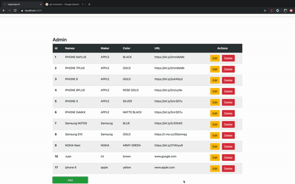
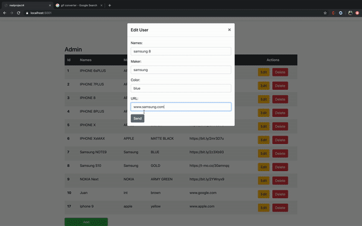

# C# Admin Page
(Pulls from my sql Database and allows users to perform the CRUD methods using a c# backend)

## Demo

THis is s c# backend with CRA (react) front-end

### Create/Read

### Update

### Delete

### Usage

1. pull from repo
2. `npm i` for the node modules
3. use `npm start` in terminal to launch
   

## Built With

- REACT.js
- C#
- MySQL
